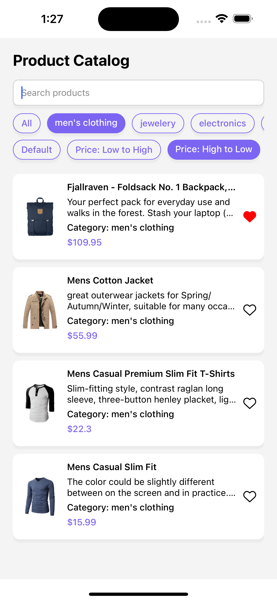

# Product Catalog App

This is a React Native app built with **Expo** to display a catalog of products. It includes features like:

- Product listing from a remote API with pagination 
- Search bar functionality
- Category filtering
- Price sorting
- Favorite and unfavorite product 
- Offline caching of products

## Tech Stack

- **React Native**
- **Expo**
- **AsyncStorage**
- **TypeScript**
- **FlatList** 

---

## 🚀 Getting Started

### 1. Prerequisites

Make sure you have the following installed:

- **Node.js** (v18 or newer)
- **Yarn** or **npm**
- **Expo CLI**  
  npm install -g expo-cli

### 2. Clone repository
git clone https://github.com/noudhar-ouanes/product-catalog-app.git
cd product-catalog-app

### 3. Install dependencies
yarn install
#### or
npm install

### 4. Run the app
yarn start
#### or
npm run start
#### or
expo start

This will launch the Expo DevTools in your browser. You can now:
- Press a to run on an Android emulator
- Press i to run on an iOS simulator on macOS
- Scan the QR code with the Expo Go app on your phone

### 5. Environment & Configuration

- API used: https://fakestoreapi.com/products

- Local storage: Uses @react-native-async-storage/async-storage

- Favorites: Stored by product ID in AsyncStorage

- Pagination: Simple client-side using PAGE_SIZE constant

### 6. Screenshots

<table>
  <tr>
    <td></td>
    <td></td>
  </tr>
  <tr>
    <td></td>
    <td></td>
  </tr>
</table>

### 7. Improvements

What I’d improve with more time
- Add comprehensive error handling and user feedback for network failures.
- Implement unit test 

### 8. Author

Noudhar Ouanes
LinkedIn : https://www.linkedin.com/in/noudhar-ouanes-464840194/